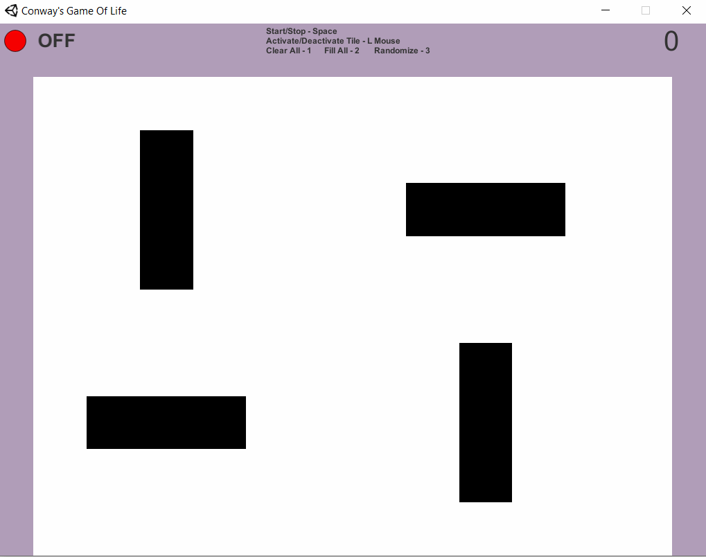
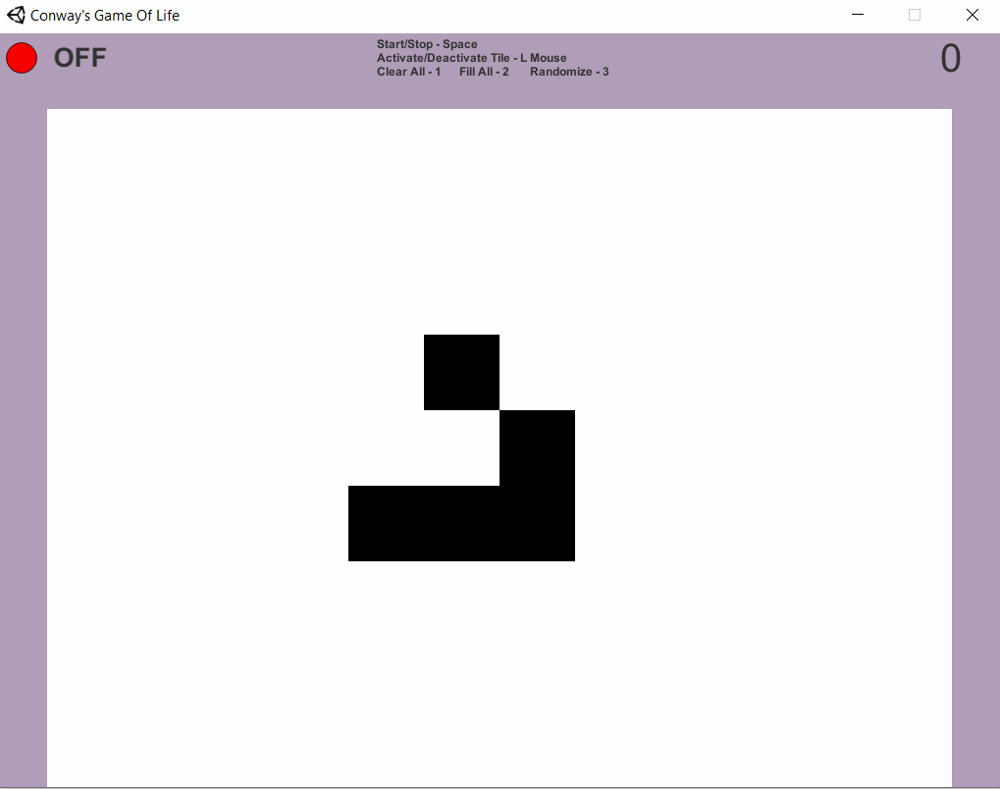
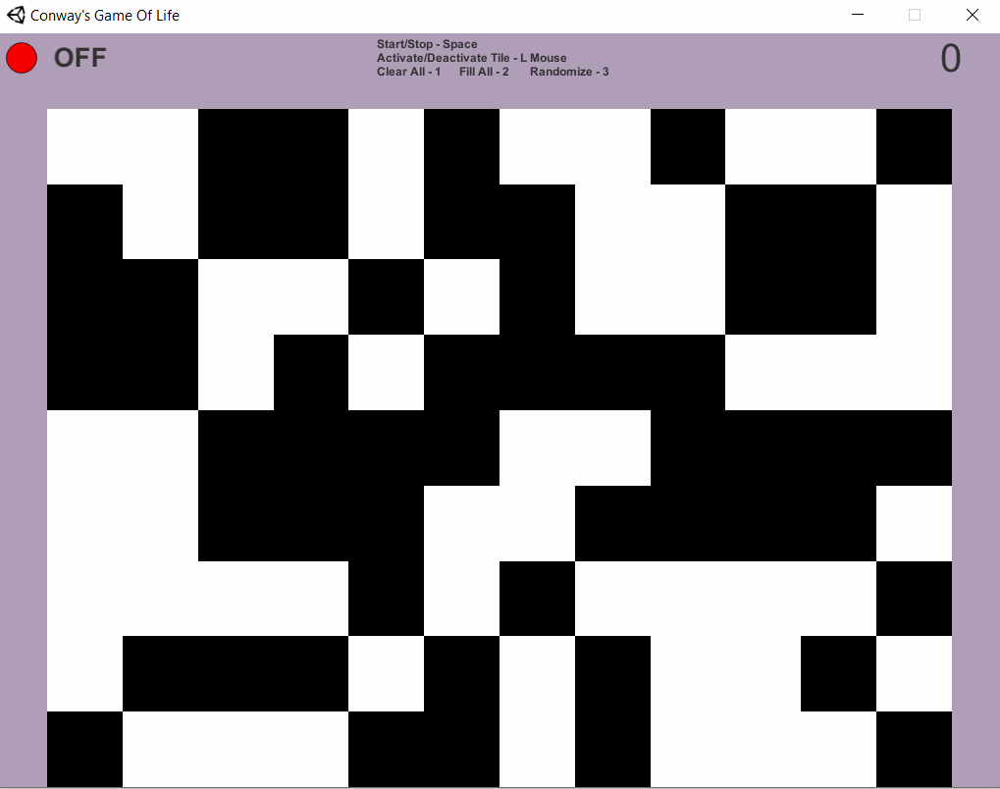

# Conway's Game Of Life

### Unity Version: 2019.4.28f1
### Explaination: 
https://en.wikipedia.org/wiki/Conway%27s_Game_of_Life  
https://home.adelphi.edu/~stemkoski/mathematrix/life.html

## Rules:
<li>Any live cell with fewer than 2 live neighbours <i>dies</i>, as if by underpopulation.</li>
<li>Any live cell with two or 3 live neighbours <i>lives</i> on to the next generation.</li>
<li>Any live cell with more than 3 live neighbours <i>dies</i>, as if by overpopulation.</li>
<li>Any dead cell with exactly 3 live neighbours becomes a <i>live cell</i>, as if by reproduction.</li>

## Samples:
### Oscillator:

### Glider:

### Randomized (Press 3):

